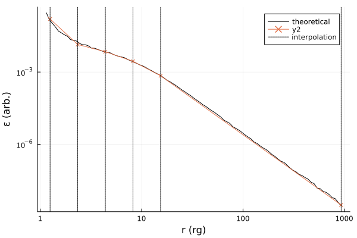

<p align="center" pa="0" ma="0">


</p>

# klineprofiles

A Cunningham transfer function integrator written in the [Zig programming language](https://ziglang.org/). Constructs relativistic lineprofile spectra for use with [SpectralFitting.jl](https://github.com/fjebaker/SpectralFitting.jl), HEASoft's [XSPEC](https://heasarc.gsfc.nasa.gov/xanadu/xspec/), and beyond. This code integrates pre-computed Green's function / Cunningham transfer functions with an interpolated emissivity function, solving

$$
F(E, \delta E) = \int_{r_0}^{R} \text{d} r \int_{E}^{E+\delta E} \text{d}g I_{\text{obs}}(r, g) \varepsilon(r),
$$

on energy grids $E$ with bin width $\delta E$.

The pre-computed transfer functions in $I_\text{obs}$ can be obtained using general relativistic ray-tracing software, such as [Gradus.jl](https://github.com/astro-group-bristol/Gradus.jl/). With every [release](https://github.com/fjebaker/lineprofiles/releases), an example table is provided for the Kerr spacetime, which interpolates over black hole spin $a$ and observer inclination $\theta$.

## Usage

To install into XSPEC, follow the guide in the [release](https://github.com/fjebaker/lineprofiles/releases) description. The latest pre-computed table model is currently v0.1.0, and can be downloaded directly from [here](https://github.com/fjebaker/lineprofiles/releases/download/v0.1.0/kerr-transfer-functions-v0.1.0.zip).

- **Note**: this model is compatible with XSPEC v12.13 onwards, and will not compile for older versions due to breaking changes in the generated model wrappers.

## Building from source

Note that building from source is not reqiured in order to use this model. See the [Usage](#usage) section above.

To build the static library from source, compile with Zig 0.12.0-dev.1647+325e0f5f0:

```bash
git clone https://github.com/fjebaker/lineprofiles \
    && cd lineprofiles \
    && zig build -Doptimize=ReleaseFast xspec
```

## Model descriptions

A number of different models are included in the source code, and additional models can be tailored to meet specific needs. _A la carte_:

### Additive

- `kline`: lineprofiles with power-law emissivities of the form $\varepsilon(r) = r^{-\alpha}$.

| Parameter | Description                                        |
| --------- | -------------------------------------------------- |
| `a`       | Unitless black hole spin                           |
| `incl`    | Observer inclination $\theta$ (degrees)            |
| `eline`   | Energy of central line (e.g. Fe K$\alpha$ 6.4 keV) |
| `alpha`   | Emissivity powerlaw index                          |
| `rmin`    | Inner radius of the accretion disc                 |
| `rout`    | Outer radius of the accretion disc                 |

- `kline5`: lineprofiles with emissivity given as an interpolated power-law between 5 knots.

| Parameter    | Description                                                                                |
| ------------ | ------------------------------------------------------------------------------------------ |
| `a`          | Unitless black hole spin                                                                   |
| `incl`       | Observer inclination $\theta$ (degrees)                                                    |
| `eline`      | Energy of central line (e.g. Fe K$\alpha$ 6.4 keV)                                         |
| `alpha`      | Emissivity powerlaw index beyond `e5`                                                      |
| `rmin`       | Inner radius of the accretion disc                                                         |
| `rout`       | Outer radius of the accretion disc                                                         |
| `e1` to `e5` | Emissivity interpolation knots (see [Emissivity interpolation](#emissivity-interpolation)) |

### Convolutional

- `kconv`: convolutional analog of `kline`.

| Parameter | Description                             |
| --------- | --------------------------------------- |
| `a`       | Unitless black hole spin                |
| `incl`    | Observer inclination $\theta$ (degrees) |
| `alpha`   | Emissivity powerlaw index               |
| `rmin`    | Inner radius of the accretion disc      |
| `rout`    | Outer radius of the accretion disc      |

- `kconv5`: convolutional analog of `kline5`.

| Parameter    | Description                                                                                |
| ------------ | ------------------------------------------------------------------------------------------ |
| `a`          | Unitless black hole spin                                                                   |
| `incl`       | Observer inclination $\theta$ (degrees)                                                    |
| `alpha`      | Emissivity powerlaw index beyond `e5`                                                      |
| `rmin`       | Inner radius of the accretion disc                                                         |
| `rout`       | Outer radius of the accretion disc                                                         |
| `e1` to `e5` | Emissivity interpolation knots (see [Emissivity interpolation](#emissivity-interpolation)) |

## Emissivity interpolation

The emissivity function in `klineN` and `kconvN` is calculated with a linear interpolation in $\log \varepsilon$, $\log r$ space; that is to say, the power law index is piecewise constant between $N$ knots $\vec{k} = (r_1, r_2, \ldots, r_N)$:

$$
\varepsilon(r, \vec{k}) = \left\{ \begin{matrix}
    \varepsilon_1, & r \leq r_1 \\
    \varepsilon_2, & r_1 < r \leq r_2 \\
    \vdots & \\
    \varepsilon_N, & r_N < r \leq r_\text{cut} \\
    r^{-\alpha} & \text{otherwise}
\end{matrix}\right. ,
$$

where the different $r_i$ are calculated as $N$ log linear intervals between the inner and some cutoff radius of the disc.

The cutoff radius $r_\text{cut}$ is under half of the outer radius of the disc in log space (see figure below). This is to fit the inner regions of the disc, where the majority of the variation in emissivity is expected.

This interpolation regime is in order to mimic the different emissivity functions of a disc irradiated by some arbitrary, axis-symmetric ionizing flux. The ionizing flux may itself be a consequence of different coronal models for the black hole. Fitting the emissivity functions should thereby allow the model to infer general properties about e.g. the morphology or position of the corona.

For example, the ionizing flux of a lamp post corona around a maximally spinning black hole at height $h = 10 r_\text{g}$ may be approximated with this emissivity interpolation:

<p align="center" pa="0" ma="0">

</p>

