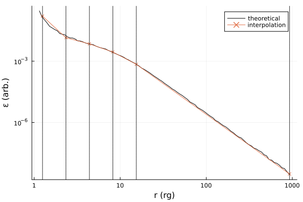

<p align="center" pa="0" ma="0">


</p>

# klineprofiles 

A [Zig](https://ziglang.org/) tool to help construct relativistic lineprofile models for use with [SpectralFitting.jl](https://github.com/fjebaker/SpectralFitting.jl), HEASoft's [XSPEC](https://heasarc.gsfc.nasa.gov/xanadu/xspec/), and beyond. This code integrates pre-computed Green's function / transfer functions with some arbitrary emissivity function for fitting purposes, solving

$$
F(E, \delta E) = \int_{r_0}^{R} \text{d} r \int_{E}^{E+\delta E} \text{d}g \, I_{\text{obs}}(r, g) \varepsilon(r),
$$

on energy grids $E$ with bin width $\delta E$. 

The pre-computed transfer functions in $I_\text{obs}$ can be obtained using general relativistic ray-tracing software, such as [Gradus.jl](https://github.com/astro-group-bristol/Gradus.jl/). With every [release](https://github.com/fjebaker/lineprofiles/releases), an example table is provided for the Kerr spacetime, which interpolates over black hole spin $a$ and observer inclination $\theta$.

## Model descriptions

A number of different models are included in the source code, and additional models can be tailored to meet specific needs. _A la carte_:

### Additive

- `kline`: lineprofiles with power-law emissivities of the form $\varepsilon(r) = r^{-\alpha}$.

<details>
    <summary>Parameter summary</summary>
<table class="source-line" data-source-line="25">
<thead>
<tr>
<th>Parameter</th>
<th>Description</th>
</tr>
</thead>
<tbody>
<tr>
<td><code>a</code></td>
<td>Black hole spin (<span class="katex"><span class="katex-mathml"><math xmlns="http://www.w3.org/1998/Math/MathML"><semantics><mrow><mi>a</mi><mo>∈</mo><mo stretchy="false">[</mo><mo>−</mo><mn>0.998</mn><mo separator="true">,</mo><mn>0.998</mn><mo stretchy="false">]</mo></mrow><annotation encoding="application/x-tex">a \in [-0.998, 0.998]</annotation></semantics></math></span><span class="katex-html" aria-hidden="true"><span class="base"><span class="strut" style="height:0.5782em;vertical-align:-0.0391em;"></span><span class="mord mathnormal">a</span><span class="mspace" style="margin-right:0.2778em;"></span><span class="mrel">∈</span><span class="mspace" style="margin-right:0.2778em;"></span></span><span class="base"><span class="strut" style="height:1em;vertical-align:-0.25em;"></span><span class="mopen">[</span><span class="mord">−</span><span class="mord">0.998</span><span class="mpunct">,</span><span class="mspace" style="margin-right:0.1667em;"></span><span class="mord">0.998</span><span class="mclose">]</span></span></span></span>)</td>
</tr>
<tr>
<td><code>incl</code></td>
<td>Observer inclination <span class="katex"><span class="katex-mathml"><math xmlns="http://www.w3.org/1998/Math/MathML"><semantics><mrow><mi>θ</mi></mrow><annotation encoding="application/x-tex">\theta</annotation></semantics></math></span><span class="katex-html" aria-hidden="true"><span class="base"><span class="strut" style="height:0.6944em;"></span><span class="mord mathnormal" style="margin-right:0.02778em;">θ</span></span></span></span> (degrees)</td>
</tr>
<tr>
<td><code>eline</code></td>
<td>Energy of the iron line (6.4 keV)</td>
</tr>
<tr>
<td><code>alpha</code></td>
<td>Emissivity powerlaw index</td>
</tr>
<tr>
<td><code>rmin</code></td>
<td>Inner radius of the accretion disc</td>
</tr>
<tr>
<td><code>rmax</code></td>
<td>Outer radius of the accretion disc</td>
</tr>
</tbody>
</table>
</details>

<p></p>

- `kline5`: lineprofiles with emissivity given as an interpolated power-law between 5 knots.

<details>
    <summary>Parameter summary</summary>
<table class="source-line" data-source-line="67">
<thead>
<tr>
<th>Parameter</th>
<th>Description</th>
</tr>
</thead>
<tbody>
<tr>
<td><code>a</code></td>
<td>Black hole spin (<span class="katex"><span class="katex-mathml"><math xmlns="http://www.w3.org/1998/Math/MathML"><semantics><mrow><mi>a</mi><mo>∈</mo><mo stretchy="false">[</mo><mo>−</mo><mn>0.998</mn><mo separator="true">,</mo><mn>0.998</mn><mo stretchy="false">]</mo></mrow><annotation encoding="application/x-tex">a \in [-0.998, 0.998]</annotation></semantics></math></span><span class="katex-html" aria-hidden="true"><span class="base"><span class="strut" style="height:0.5782em;vertical-align:-0.0391em;"></span><span class="mord mathnormal">a</span><span class="mspace" style="margin-right:0.2778em;"></span><span class="mrel">∈</span><span class="mspace" style="margin-right:0.2778em;"></span></span><span class="base"><span class="strut" style="height:1em;vertical-align:-0.25em;"></span><span class="mopen">[</span><span class="mord">−</span><span class="mord">0.998</span><span class="mpunct">,</span><span class="mspace" style="margin-right:0.1667em;"></span><span class="mord">0.998</span><span class="mclose">]</span></span></span></span>)</td>
</tr>
<tr>
<td><code>incl</code></td>
<td>Observer inclination <span class="katex"><span class="katex-mathml"><math xmlns="http://www.w3.org/1998/Math/MathML"><semantics><mrow><mi>θ</mi></mrow><annotation encoding="application/x-tex">\theta</annotation></semantics></math></span><span class="katex-html" aria-hidden="true"><span class="base"><span class="strut" style="height:0.6944em;"></span><span class="mord mathnormal" style="margin-right:0.02778em;">θ</span></span></span></span> (degrees)</td>
</tr>
<tr>
<td><code>eline</code></td>
<td>Energy of the iron line (6.4 keV)</td>
</tr>
<tr>
<td><code>alpha</code></td>
<td>Emissivity powerlaw index everywhere beyond <code>e5</code></td>
</tr>
<tr>
<td><code>rmin</code></td>
<td>Inner radius of the accretion disc</td>
</tr>
<tr>
<td><code>rmax</code></td>
<td>Outer radius of the accretion disc</td>
</tr>
<tr>
<td><code>e1</code> - <code>e5</code></td>
<td>Emissivity interpolation knots (see <a href="#emissivity-interpolation">Emissivity interpolation</a>)</td>
</tr>
</tbody>
</table>
</details>

<p></p>

### Convolutional

- `kconv`: convolutional analog of `kline`.

<details>
    <summary>Parameter summary</summary>
<table class="source-line" data-source-line="25">
<thead>
<tr>
<th>Parameter</th>
<th>Description</th>
</tr>
</thead>
<tbody>
<tr>
<td><code>a</code></td>
<td>Black hole spin (<span class="katex"><span class="katex-mathml"><math xmlns="http://www.w3.org/1998/Math/MathML"><semantics><mrow><mi>a</mi><mo>∈</mo><mo stretchy="false">[</mo><mo>−</mo><mn>0.998</mn><mo separator="true">,</mo><mn>0.998</mn><mo stretchy="false">]</mo></mrow><annotation encoding="application/x-tex">a \in [-0.998, 0.998]</annotation></semantics></math></span><span class="katex-html" aria-hidden="true"><span class="base"><span class="strut" style="height:0.5782em;vertical-align:-0.0391em;"></span><span class="mord mathnormal">a</span><span class="mspace" style="margin-right:0.2778em;"></span><span class="mrel">∈</span><span class="mspace" style="margin-right:0.2778em;"></span></span><span class="base"><span class="strut" style="height:1em;vertical-align:-0.25em;"></span><span class="mopen">[</span><span class="mord">−</span><span class="mord">0.998</span><span class="mpunct">,</span><span class="mspace" style="margin-right:0.1667em;"></span><span class="mord">0.998</span><span class="mclose">]</span></span></span></span>)</td>
</tr>
<tr>
<td><code>incl</code></td>
<td>Observer inclination <span class="katex"><span class="katex-mathml"><math xmlns="http://www.w3.org/1998/Math/MathML"><semantics><mrow><mi>θ</mi></mrow><annotation encoding="application/x-tex">\theta</annotation></semantics></math></span><span class="katex-html" aria-hidden="true"><span class="base"><span class="strut" style="height:0.6944em;"></span><span class="mord mathnormal" style="margin-right:0.02778em;">θ</span></span></span></span> (degrees)</td>
</tr>
<tr>
<td><code>alpha</code></td>
<td>Emissivity powerlaw index</td>
</tr>
<tr>
<td><code>rmin</code></td>
<td>Inner radius of the accretion disc</td>
</tr>
<tr>
<td><code>rmax</code></td>
<td>Outer radius of the accretion disc</td>
</tr>
</tbody>
</table>
</details>

<p></p>

- `kconv5`: convolutional analog of `kline5`.

<details>
    <summary>Parameter summary</summary>
<table class="source-line" data-source-line="67">
<thead>
<tr>
<th>Parameter</th>
<th>Description</th>
</tr>
</thead>
<tbody>
<tr>
<td><code>a</code></td>
<td>Black hole spin (<span class="katex"><span class="katex-mathml"><math xmlns="http://www.w3.org/1998/Math/MathML"><semantics><mrow><mi>a</mi><mo>∈</mo><mo stretchy="false">[</mo><mo>−</mo><mn>0.998</mn><mo separator="true">,</mo><mn>0.998</mn><mo stretchy="false">]</mo></mrow><annotation encoding="application/x-tex">a \in [-0.998, 0.998]</annotation></semantics></math></span><span class="katex-html" aria-hidden="true"><span class="base"><span class="strut" style="height:0.5782em;vertical-align:-0.0391em;"></span><span class="mord mathnormal">a</span><span class="mspace" style="margin-right:0.2778em;"></span><span class="mrel">∈</span><span class="mspace" style="margin-right:0.2778em;"></span></span><span class="base"><span class="strut" style="height:1em;vertical-align:-0.25em;"></span><span class="mopen">[</span><span class="mord">−</span><span class="mord">0.998</span><span class="mpunct">,</span><span class="mspace" style="margin-right:0.1667em;"></span><span class="mord">0.998</span><span class="mclose">]</span></span></span></span>)</td>
</tr>
<tr>
<td><code>incl</code></td>
<td>Observer inclination <span class="katex"><span class="katex-mathml"><math xmlns="http://www.w3.org/1998/Math/MathML"><semantics><mrow><mi>θ</mi></mrow><annotation encoding="application/x-tex">\theta</annotation></semantics></math></span><span class="katex-html" aria-hidden="true"><span class="base"><span class="strut" style="height:0.6944em;"></span><span class="mord mathnormal" style="margin-right:0.02778em;">θ</span></span></span></span> (degrees)</td>
</tr>
<tr>
<td><code>alpha</code></td>
<td>Emissivity powerlaw index everywhere beyond <code>e5</code></td>
</tr>
<tr>
<td><code>rmin</code></td>
<td>Inner radius of the accretion disc</td>
</tr>
<tr>
<td><code>rmax</code></td>
<td>Outer radius of the accretion disc</td>
</tr>
<tr>
<td><code>e1</code> - <code>e5</code></td>
<td>Emissivity interpolation knots (see <a href="#emissivity-interpolation">Emissivity interpolation</a>)</td>
</tr>
</tbody>
</table>
</details>

<p></p>

## Usage

See the [releases](https://github.com/fjebaker/lineprofiles/releases) and guidance in the release notes for using different versions of this model.

## Emissivity interpolation

The emissivity function in `klineN` and `kconvN` is calculated with a linear interpolation in $\log \varepsilon$, $\log r$ space; that is to say, the power law index is piecewise constant between $N$ knots $\vec{k} = (\alpha_1, \alpha_2, \ldots, \alpha_N)$:

$$
\varepsilon(r, \vec{k}) = \left\{ \begin{matrix}
    e^\alpha_1, & r \leq r_1 \\
    e^\alpha_2, & r_1 < r \leq r_2 \\
    \vdots & \\
    e^\alpha_N, & r_N < r \leq r_\text{cut} \\
    e^\alpha & \text{otherwise}
\end{matrix}\right. ,
$$

The cutoff radius $r_\text{cut}$ is just under half of the outer radius of the disc in log space.

where the different $r_i$ are calculated as $N$ log linear intervals between the inner and outer radius of the disc. 


This interpolation regime is in order to mimic the different emissivity functions of a disc irradiated by some arbitrary, axis-symmetric ionizing flux. The ionizing flux may itself be a consequence of different coronal models for the black hole. Fitting the emissivity functions should thereby allow the model to infer general properties about e.g. the morphology or position of the corona.

For example, the ionizing flux of a lamp post corona around a maximally spinning black hole at height $h = 10\, r_\text{g}$ may be approximated with this emissivity interpolation:

<p align="center" pa="0" ma="0">

</p>


## Building from source

To build the static library from source, compile with Zig v0.11 (current master):

```bash
git clone --recursive https://github.com/fjebaker/lineprofiles \
    && cd lineprofiles \
    && zig build -Doptimize=ReleaseFast xspec
```
